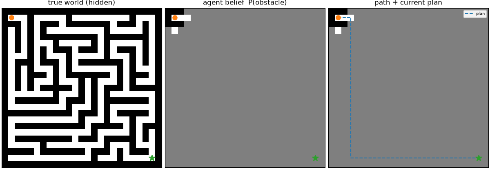

# fogwalker

**belief-state navigation through an unknown grid.**

fogwalker drops an agent into a map it has never seen. the agent keeps a
probabilistic occupancy grid, plans through what it currently believes, moves
one step, and checks again. it reaches the goal without building a full map.

this is a small, inspectable model of belief-state navigation. its belief is a
hand-designed occupancy grid, not a learned world model or production robotics
stack.



left: hidden world. middle: the agent's belief. right: walked path and current
plan.

## how it works

1. a short-range sensor reveals nearby cells.
2. `belief.py` updates per-cell obstacle probabilities in log-odds form.
3. `planner.py` runs A* over that belief. known walls are blocked; fog stays
   traversable.
4. the agent takes one move and replans with the next observation.

unknown cells start at `P(obstacle) = 0.5`. the default perfect sensor pushes
an observed cell straight to known-free or known-wall. the planner can also add
a probability-weighted risk cost with `--lam`.

## results

recorded on 25x25 maps with sensor radius 2 and three seeds per map:

```text
map       seed  outcome  steps  optimal  ratio  replans  revealed  known
------------------------------------------------------------------------
open         0  success     44       44   1.00        0       182    29%
open         1  success     44       44   1.00        0       182    29%
open         2  success     44       44   1.00        0       182    29%
maze         0  success    160       62   2.58       71       477    76%
maze         1  success     70       70   1.00       38       248    40%
maze         2  success    130      116   1.12       65       422    68%
clutter      0  success     52       44   1.18       12       211    34%
clutter      1  success     52       44   1.18       15       204    33%
clutter      2  success     70       44   1.59       12       219    35%
```

`ratio` is the walked path length divided by the shortest path with the full
map known. open maps match that optimum while revealing 29% of the grid. mazes
cost more because hidden dead ends force backtracking.

## run

requires Python 3.10 or newer.

```bash
python -m pip install -r requirements.txt
python main.py
python main.py --map maze --seed 2
python main.py --map clutter --gif out/clutter.gif
python main.py --all
```

main options:

- `--map {simple,open,maze,clutter}`
- `--size` for generated maps; the fixed `simple` map ignores it
- `--radius` for sensor range
- `--lam` for risk aversion
- `--gif` to render an episode

even maze sizes round up so the wall lattice stays aligned.

## tests

```bash
python -m pip install -r requirements-dev.txt
python -m pytest -q
```

the suite covers belief updates, optimistic planning, blocked paths, episode
termination, input validation, and deterministic connected map generation.
github actions runs it on every push and pull request.

## structure

| file | role |
|---|---|
| `world.py` | grid model and seeded map generators |
| `sensor.py` | limited-radius ground-truth observations |
| `belief.py` | log-odds occupancy belief |
| `planner.py` | A* over known and unknown cells |
| `agent.py` | observe, update, plan, move loop |
| `stats.py` | optimal baseline and episode metrics |
| `viz.py` | three-panel GIF rendering |
| `main.py` | command-line interface |
| `tests/` | behavior and regression tests |

## current limits

- obstacles are static
- sensing is perfect and unoccluded
- A* runs from scratch after every observation
- movement is limited to four directions

these choices keep the belief update and replanning loop easy to inspect.

## license

[MIT](LICENSE)
